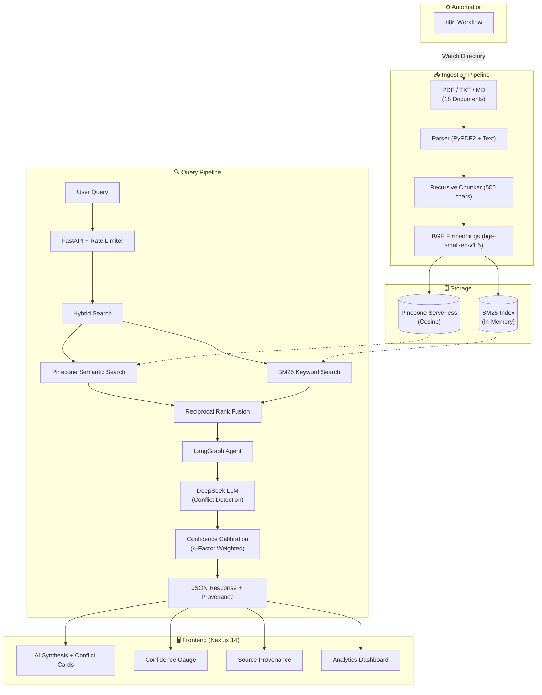

# ⚡ Envint AI — RAG Conflict Detection Engine

> **Option A** — RAG Robustness & Conflict Detection (Document QA)

An end-to-end Retrieval-Augmented Generation system that ingests heterogeneous hospital performance documents, detects conflicting claims across departments, and presents AI-synthesized answers with full provenance traceability.

---

## 🏗️ Architecture




---

## 🔬 Key Features

| Feature | Description |
|---|---|
| **Hybrid Retrieval** | BM25 keyword search + Pinecone vector search merged via Reciprocal Rank Fusion (70/30 weighting) |
| **Conflict Detection** | LLM identifies numerical and factual contradictions across departments |
| **Confidence Calibration** | Weighted 4-factor score: Retrieval Similarity (40%), LLM Self-Confidence (30%), Source Diversity (15%), Score Consistency (15%) |
| **Source Provenance** | Every answer links to document IDs, snippets, similarity scores, and author metadata |
| **Chunk Explainer** | "Show Details" modal with AI-powered analysis of top 3 most relevant chunks |
| **Analytics Dashboard** | Score distribution, conflict density, department breakdown, avg similarity |
| **Rate Limiting** | `slowapi` enforces per-IP query limits |
| **n8n Automation** | File watcher workflow triggers ingestion on new uploads |

---

## 📊 Dataset

### Overview
**18 synthetic hospital performance documents** spanning 10 departments, designed to realistically mimic enterprise data silos where different departments report contradictory information.

| Property | Value |
|---|---|
| Total Documents | 18 |
| File Formats | PDF (11), TXT (4), MD (3) |
| Total Chunks (after splitting) | 107 |
| Chunk Size / Overlap | 500 characters / 50 characters |
| Embedding Model | `BAAI/bge-small-en-v1.5` (384 dimensions) |
| Conflict Pairs | 5 intentional contradictions |
| Standalone (No Conflict) | 8 documents |

### Conflict Map

| Pair | Topic | Doc A (Claim) | Doc B (Contradicts) |
|---|---|---|---|
| 1 | Patient Satisfaction | `01_Patient_Relations` → "+20% improvement" | `02_Emergency_Dept` → "+25% complaints" |
| 2 | MRI Machine | `03_Radiology` → "Fully operational" | `04_Facilities` → "Delayed, non-operational" |
| 3 | Infection Rates | `05_Surgical` → "SSI at 1.2%" | `06_ICU` → "HAI spiked to 4.5%" |
| 4 | Staffing Levels | `07_HR` → "100% staffed" | `08_NightShift_Log` → "Severe shortages" |
| 5 | Financial / Overtime | `09_Finance` → "Overtime reduced" | `10_Union_Grievance` → "Overtime doubled" |

### Non-Conflict Documents
| Doc | Department | Topic |
|---|---|---|
| `11_Lab_Turnaround` | Laboratory | TAT improvement metrics |
| `12_Pharmacy_Inventory` | Pharmacy | Medication safety report |
| `13_Pediatric_Ward` | Pediatrics | Patient satisfaction (consistent) |
| `14_Security_Incident` | Security | Q1 incident summary |
| `15_Training_Completion` | Education | Staff training compliance |
| `16_Dietary_Services` | Dietary | Food quality improvement |
| `17_IT_Systems_Uptime` | IT | Systems availability report |
| `18_Quality_Committee` | Quality | Committee meeting minutes |

### Data Source & Preprocessing
- **Source:** Self-created synthetic dataset generated via `scripts/generate_data.py`
- **Conflicts:** Intentionally planted numerical contradictions across department reports (e.g., HR claims 100% staffing while night shift logs document severe shortages)
- **Preprocessing:** Documents are parsed (PyPDF2 for PDFs, raw text for TXT/MD), chunked using `RecursiveCharacterTextSplitter` (500 chars, 50 overlap), embedded locally with HuggingFace BGE, and upserted to Pinecone with full metadata (department, date, author, source_type)

---

## 🧠 Technology Choices

### Vector DB: Pinecone Serverless

| Vector DB | Managed? | Hybrid Search | Scale | Latency | Why We Chose |
|---|---|---|---|---|---|
| **Pinecone** ✅ | Yes (Serverless) | Metadata Filtering | Billions | ~50ms | Zero-ops, production-grade, auto-scaling |
| FAISS | No (Local) | No | Millions | ~5ms | Fast but no persistence, no metadata filtering |
| Chroma | Semi (Local/Cloud) | No | Thousands | ~10ms | Great for prototyping, limited at scale |
| Weaviate | Yes (Cloud) | Yes (built-in BM25) | Billions | ~80ms | Strong hybrid but heavier infrastructure |

**Decision:** Pinecone was selected for its zero-infrastructure overhead, sub-100ms latency, and native cloud scaling. BM25 is handled in-application via `rank_bm25` to achieve hybrid retrieval without requiring Weaviate's heavier stack.

### LLM: DeepSeek Chat
- Excellent reasoning-to-cost ratio for strict JSON schema adherence
- Self-assessed `llm_confidence` (0-100) for confidence calibration
- Temperature 0.3 for deterministic conflict analysis

### Embeddings: BAAI/bge-small-en-v1.5
- Runs locally (free, no API costs)
- 384 dimensions — compact yet high-quality (top MTEB rankings)
- DeepSeek doesn't offer embeddings, so local BGE is the practical choice

### Retrieval: Hybrid (BM25 + Vector + RRF)
- **Semantic search** (Pinecone cosine similarity) captures meaning
- **BM25 keyword search** catches exact term matches (e.g., "MRI", "infection")
- **Reciprocal Rank Fusion** (k=60, 70% vector / 30% BM25) merges both ranked lists

---

## 🚀 Reproduction Steps

### 1. Prerequisites
- Python 3.10+
- Node.js v18+
- [Pinecone Account](https://www.pinecone.io/) (free tier works)
- [DeepSeek API Key](https://platform.deepseek.com/)

### 2. Backend Setup
```bash
cd backend
python -m venv venv

# Windows
venv\Scripts\activate
# Mac/Linux
source venv/bin/activate

pip install -r requirements.txt
```

Create `backend/.env`:
```env
PINECONE_API_KEY="your-pinecone-key"
PINECONE_INDEX_NAME="envint-rag"
DEEPSEEK_API_KEY="your-deepseek-key"
```

### 3. Generate Data & Ingest
```bash
cd backend

# Generate 18 heterogeneous hospital documents with intentional conflicts
python -m scripts.generate_data

# Parse → Chunk (500 chars) → Embed (BGE) → Upsert to Pinecone (107 vectors)
python -m scripts.ingest
```

### 4. Run Servers
**Terminal 1 — Backend API:**
```bash
cd backend
uvicorn main:app --host 0.0.0.0 --port 8000
```

**Terminal 2 — Frontend:**
```bash
cd frontend
npm install
npm run dev
```

Open **http://localhost:3000** to interact with the system.

### 5. n8n Automation (Optional)
Import `workflows/n8n_workflow.json` into a local n8n instance (`npx n8n`). The workflow watches the `data/` directory for new files and triggers the ingestion pipeline automatically.

---

## 🧪 Sample Queries

| Query | Expected Behavior |
|---|---|
| "Has patient satisfaction improved in Q1?" | ⚔️ Conflict: Survey (+20%) vs ER complaints (+25%) |
| "Is the new MRI machine operational?" | ⚔️ Conflict: Radiology (operational) vs Facilities (delayed) |
| "Are infection rates decreasing?" | ⚔️ Conflict: Surgery (1.2%) vs ICU (4.5%) |
| "What is the lab turnaround time?" | ✅ No conflict: Clean improvement data |
| "How is the pharmacy performing?" | ✅ No conflict: 18-month streak, zero sentinel events |

---

## 📁 Project Structure

```
Envint/
├── backend/
│   ├── main.py                    # FastAPI server + endpoints
│   ├── requirements.txt
│   ├── .env                       # API keys
│   ├── rag/
│   │   ├── graph.py               # LangGraph RAG pipeline
│   │   ├── hybrid_search.py       # BM25 + Vector + RRF fusion
│   │   ├── pinecone_utils.py      # Pinecone client
│   │   ├── embeddings.py          # HuggingFace BGE embeddings
│   │   └── prompts.py             # Conflict detection prompt
│   └── scripts/
│       ├── generate_data.py       # Synthetic dataset generator
│       ├── ingest.py              # Ingestion pipeline
│       └── test_rag.py            # CLI test script
├── frontend/
│   └── src/app/
│       ├── page.tsx               # Main UI (Next.js 14)
│       ├── layout.tsx
│       └── globals.css
├── data/                          # 18 generated hospital documents
├── workflows/
│   └── n8n_workflow.json          # Automation workflow
├── design_doc.md                  # Scalability & architecture plan
└── results.md                     # Sample query outputs
```
